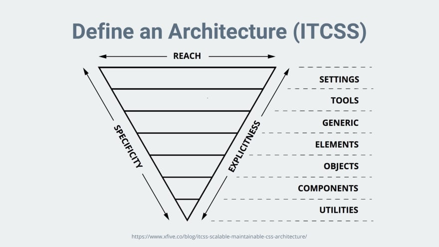

# CUBE CSS

https://cube.fyi/

## BEM

- zapoudřeno v komponentách
- stále se opakující patterny

## Utility class frameworky

- Tailwind, atp.
- nezná problém oakujících se patternů
- imho rychlejší práce (pouze s html)
- minimální podpora tvorby komponent (první případ -> komponenta složená z TW tříd)

---

## Není to o jmenné konvenci tříd, ale o  KOMPOZICI našeho CSS

---

## ITCSS metodologie


- https://frontend.garden/clanky/proc-je-itcss-nejpokrocilejsi-metodika-organizace-css/


## Autor


- Andy Bell
- https://css-tricks.com/author/andybell/


## Co znamená CUBE CSS

- C omposition
- U tility
- B lock
- E xception


## CUBE CSS vs BEM

- opačný přístup  
- CUBE CSS jde od abstraktních tříd ke konkrétním
- snaž se nejprve použít obecné třídy, o kterých víme, že se budou v projektu opakovat (Composition, Utility)
- teprve když to nedává smysl, použij konkrétní (Block, Exception)

## COMPOSITION
- high-level, flexible layouts
- flow and rhythm
- layoutové třídy (skeletons, grids)

## UTILITY

- utility třídy ala Tailwind

## BLOCK

- komponenty podobně jako v BEM
- CUBE CSS nenařizuje žádnou jmennou konvenci
- je to na vás
- klidně je možné použít BEM

```
<div class="card">
  <div class="card__title">...</div>
  <div class="card__content">...</div>
</div>
```

## EXCEPTION

- modifiers
- řeší se pomocí data-atributes
- BLBuvzdornost
- v BEM lze teoreticky napsat několik modifikátorů stejného typu, CSS rozhodne, který se použije

```
<button class="button" data-type="primary">...</button>
```


## Grouping

```
<article class="[ card ] [ section box ] [ bg-base color-primary ]"></article>
```
- nemusíte nutně používat jen []


